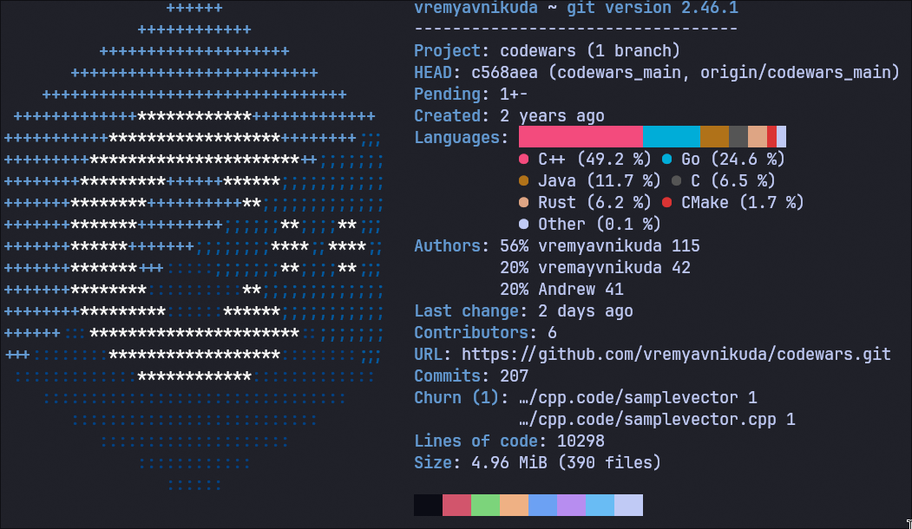

# codewars

```
Directory structure:
└── vremyavnikuda-codewars
    ├── c++
    │   ├── lab3
    │   ├── practice
    │   ├── yandex_run
    │   ├── 3semestr
    │   │   ├── lab_2
    │   │   ├── lab_5
    │   │   ├── lab_1
    │   │   ├── lab_8
    │   │   ├── lab_7
    │   │   ├── lab_6
    │   │   ├── kur_1
    │   │   ├── lab_3
    │   │   └── lab_4
    │   ├── task2
    │   ├── offer_task.cpp
    │   ├── learn
    │   ├── task3
    │   ├── task1.cpp
    │   ├── lab6_l_doz
    │   ├── task4
    │   ├── myLabInformatica
    │   ├── task5
    │   ├── cpp.code
    │   ├── lab5
    │   ├── lab_6
    │   ├── programming
    │   │   └── материалы к экземену
    │   ├── mrrrrrrrrrrr
    │   ├── function
    │   ├── task9
    │   ├── task8
    │   ├── lab1
    │   ├── lab6
    │   ├── block_schema
    │   │   ├── task8
    │   │   ├── task10
    │   │   ├── task7
    │   │   └── task1
    │   ├── kr_informatika
    │   ├── offer.md
    │   ├── lab2_prog_c++
    │   ├── lab_len
    │   ├── task7
    │   ├── informatica
    │   ├── lab4
    │   └── task1
    ├── rust_task
    ├── ts_task
    ├── go
    │   ├── archive
    │   └── golang
    ├── README.md
    └── src
        ├── kata_8
        ├── kata_7
        ├── offertask
        ├── kata_6
        └── kata_5

```

